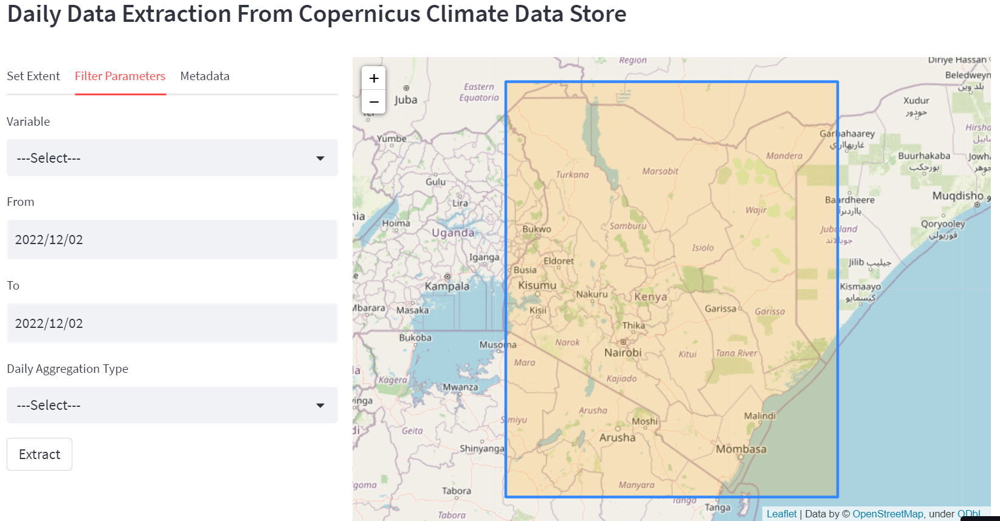

# Extract data from Copernicus Climate Data Store into a csv file
This program provides an interactive web application for extracting daily data from climate data store using ## cdsapi. It enables user to enter the following filtering parameters.
- Area extent
- Variable of interest
- Date range
- Aggregation type

## Methodology
- Specification of filtering parameters
- Hourly data for the entire day are extracted (24 hrs)
- 24 hour data downloaded is saved as netcdf format
- Perform aggregation as specified by the user (sum, maximum, minimum & average)
- Reading netcdf data into pandas dataframe
- Latitude & Longitude coordinates are then added into the dataframe

## Application Interface

[Visit Application](https://amon957-cds-data-extracter-climate-data-extracter-xsmm00.streamlit.app/)
